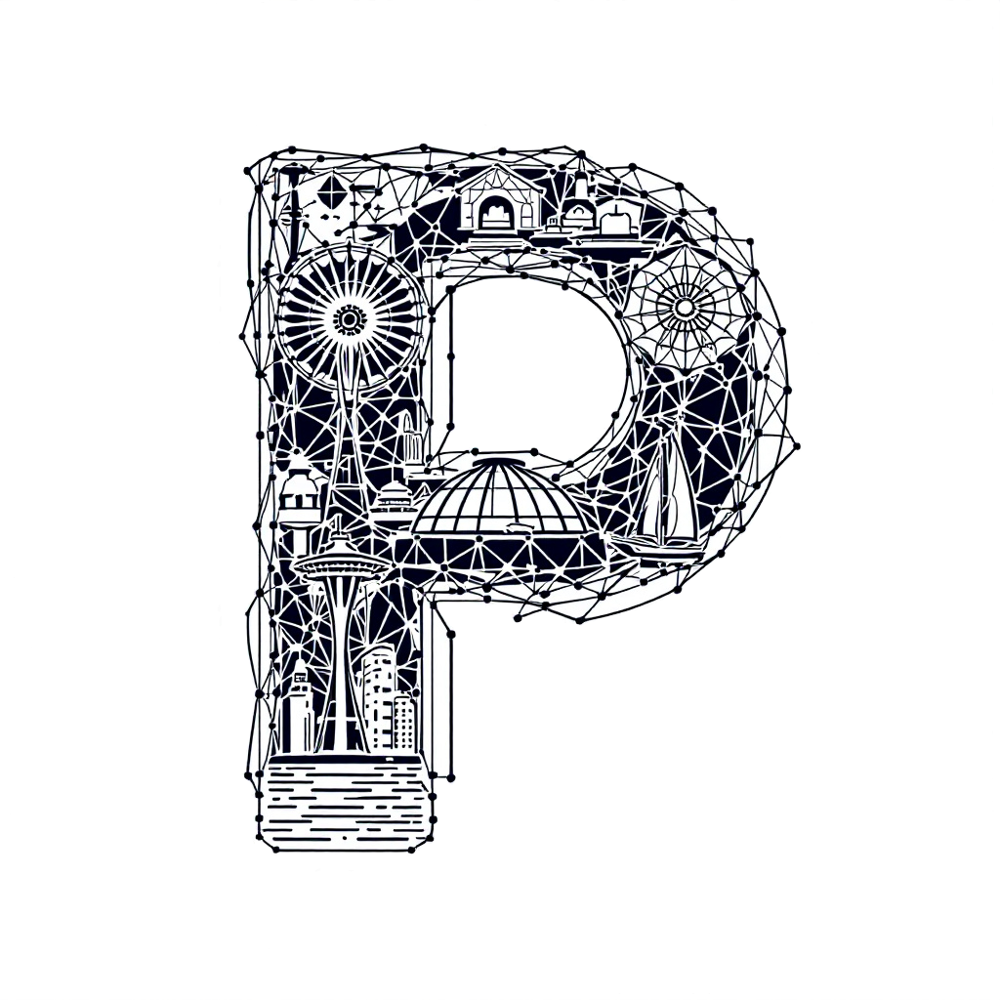

# Welcome to Puget Mesh

## Get Started with a Network

<!-- Typically we just use markdown, but html technically works when md is too limiting -->
<a href="Meshtastic/getting-started.md"><button class="btn btn-lg btn-primary">Meshtastic</button></a>
<a href="AREDN/getting-started.md"><button class="btn btn-lg btn-primary">AREDN</button></a>